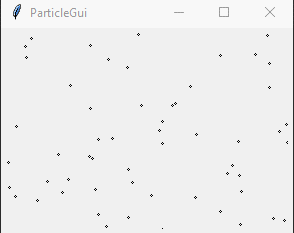

# Particles

Experiments with Python, tkinter and particles.



## Run

```shell
$ pythonw particles_gui.py
```

## Control

- **Left mouse button**: a small random particles movement
- **Middle mouse button**: shuffle particles
- **Right mouse button**: move particles to mouse pointer
